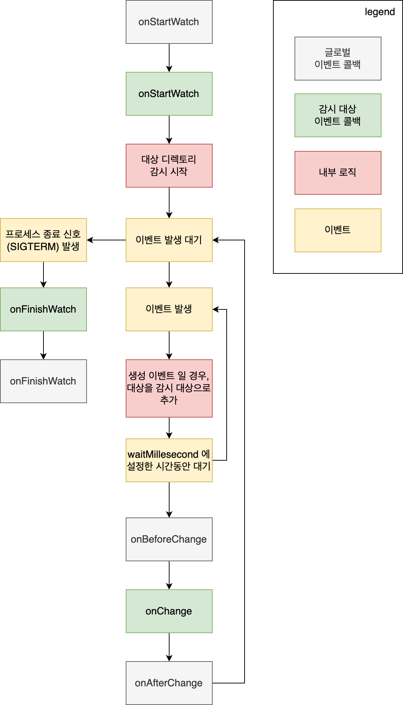

<p align="center">
    <a href="README.md"><b>영어</b></a> •
    <a href="README.ko.md"><b>한국어</b></a>
</p>

# Directory Watcher

디렉토리 내 변경 (생성, 수정, 삭제)이 발생 시 정해진 커맨드를 실행하게 하는 프로그램입니다.
이 도구를 사용하면 파일 시스템의 변경 사항에 대해 실시간으로 반응하고, 이러한 변경 사항에 따라 특정 작업을 자동화할 수 있습니다.
예를 들어, 특정 디렉토리에서 파일이 변경되면 자동으로 백업을 만들거나, 코드가 변경되면 테스트를 실행하는 등의 작업을 설정할 수 있습니다.

## 기능 및 특징

- 여러개의 디렉토리 감시 가능
- 각 디렉토리 별 변경 발생 시 실행되는 커맨드 개별 설정 가능
- 공통적으로 실행되어야 하는 커맨드 설정, 감시 시작 및 감시 종료 시 실행되어야 하는 커맨드 설정 가능
- 감시 대상 디렉토리 내 감시 제외 디렉토리 추가 가능
- 감시 대상 디렉토리 내 감시 제외 접미사 추가 가능
- 이벤트 발생 후, hook을 실행하는 사이 대기시간 설정 가능
- 하위 디렉토리 감시 여부 설정 가능
- 감시 이벤트 설정 가능 (C: 생성, U: 수정, D: 삭제)
- 실행 커맨드 내 사용가능 변수 설정 가능

## 설치

### Homebrew

```shell
brew install seungyeop-lee/tap/directory-watcher
```

### `go install`

```shell
go install github.com/seungyeop-lee/directory-watcher/v2@latest
```

### Docker

```shell
docker pull ghcr.io/seungyeop-lee/directory-watcher
```

### Releases

[releases page](https://github.com/seungyeop-lee/directory-watcher/releases/latest)에서 실행파일을 다운로드

## 사용법

다음의 커맨드를 통해 `directory-watcher`를 실행할 수 있습니다.

```shell
directory-watcher
```

또한 docker를 사용하여 실행할 수 있습니다.

```shell
docker run --rm ghcr.io/seungyeop-lee/directory-watcher

# 알려진 이슈: bind mount된 디렉토리에서 파일 삭제 시 삭제 이벤트 누락
# 호스트 시스템에서 컨테이너에 bind mount된 디렉토리 내의 파일을 삭제할 경우, 삭제 이벤트가 항상 감지되는 것은 아닙니다. 
# 이는 파일 시스템 알림 라이브러리(fsnotify)의 알려진 문제입니다.
# 자세한 내용은 다음을 참조하세요: https://github.com/fsnotify/fsnotify/issues/592
```

이 커맨드는 다음과 같은 옵션을 제공합니다.

```shell
Usage:
  directory-watcher [flags]

Flags:
  -c, --config-path string   set config path (default "config.yml")
  -h, --help                 help for directory-watcher
  -l, --log-level string     set log level (default "ERROR")
  -v, --version              version for directory-watcher
```

## config.yml

실제 파일은 `config.example.yml` 예제 참조.
`config.yml` 파일은 감시할 디렉토리와 각 디렉토리에서 발생하는 변경에 대해 실행할 커맨드를 정의합니다.
또한, 감시를 시작하거나 종료할 때 실행할 커맨드를 정의할 수도 있습니다.

```yaml
global:
  lifeCycle:
    onStartWatch: # global onStartWatch hook
      - '실행 커맨드'
      - dir: '실행 커맨드가 실행 될 디렉토리경로'
        cmd: '실행 커맨드'
      - dir: '실행 커맨드가 실행 될 디렉토리경로'
        cmd:
          - '실행 커맨드 1'
          - '실행 커맨드 2'
    onBeforeChange: # global onBeforeChange hook
      [ global onStartWatch hook의 사양과 동일 ]
    onAfterChange: # global onAfterChange hook
      [ global onStartWatch hook의 사양과 동일 ]
    onFinishWatch: # global onFinishWatch hook
      [ global onStartWatch hook의 사양과 동일 ]
watchTargets:
  - path: [ 감시대상 폴더 path ]
    lifeCycle:
      onStartWatch: # onStartWatch hook
        [ global onStartWatch hook의 사양과 동일 ]
      onChange: # onChange hook
        [ global onStartWatch hook의 사양과 동일 ]
      onFinishWatch: # onFinishWatch hook
        [ global onStartWatch hook의 사양과 동일 ]
    option:
      excludeDir:
        - [ 감시 제외대상 폴더 path ]
      excludeSuffix:
        - [ 감시 제외대상 파일 접미사 ]
      waitMillisecond: [ 이벤트 발생 후, hook을 실행하는 사이 대기시간, default는 100 ]
      watchSubDir: [ 하위 디렉토리 감시 여부, default는 true ]
      watchEvent: [ 감시 이벤트 (C: 생성, U: 수정, D: 삭제), default는 "CUD" ]
      noWait: [ 이벤트 발생 후 대기시간 없이 바로 hook을 실행할지 여부, default는 false ]
```

### cmd 실행 위치

다음은 각 hook에 대한 커맨드 실행 위치를 설명합니다.

| dir | global onStartWatch, global onFinishWatch | 그외 hook    |
|-----|-------------------------------------------|------------|
| O   | dir 설정 위치                                 | dir 설정 위치  |
| X   | 프로그램 실행 위치                                | path 설정 위치 |

### 실행 커맨드 내 사용가능 변수

| 변수              | 설명                           | 예시 (`test/dir2`을 감시 대상 폴더로 설정했을 경우)              |
|-----------------|------------------------------|--------------------------------------------------|
| {{.Path}}       | 이벤트가 일어난 파일의 상대 경로           | test/dir2/b.txt                                  |
| {{.AbsPath}}    | 이벤트가 일어난 파일의 절대 경로           | /Users/example/directory-watcher/test/dir2/b.txt |
| {{.FileName}}   | 이벤트가 일어난 파일 이름               | b.txt                                            |
| {{.ExtName}}    | 이벤트가 일어난 파일의 확장자             | .txt                                             |
| {{.DirPath}}    | 이벤트가 일어난 파일이 속한 디렉토리 상대 경로   | test/dir2                                        |
| {{.DirAbsPath}} | 이벤트가 일어난 파일이 속한 디렉토리 절대 경로   | /Users/example/directory-watcher/test/dir2       |
| {{.Event}}      | 이벤트 종류 (C: 생성, U: 수정, D: 삭제) | C                                                |

## 주의사항

### waitMillisecond와 noWait

- `watchTargets.path` 내부에서 이벤트가 발생하게 되면 waitMillisecond 만큼 대기 후 hook을 실행합니다.
- 대기 중 `watchTargets.path` 내부에서 다른 이벤트가 발생하게 되면 그 전 이벤트는 무시됩니다. 즉, 새로 생긴 이벤트 기준으로 waitMillisecond 만큼 다시 대기 후 hook을 실행합니다.
- `watchTargets.path` 내부의 이벤트가 무시되지 않고, 모든 이벤트로 인해 hook이 즉시 실행되길 원한다면 noWait를 true로 설정합니다. (이벤트에 대한 hook은 순차적으로 실행됩니다.)

### 폴더 이벤트 감지에 대한 제약사항

- 기본동작은 감시 대상 폴더 내의 **파일**의 이벤트에 따라 hook을 실행합니다.
- 즉, 폴더의 생성 및 이름 수정으로는 hook이 실행되지 않습니다.
- 그러나, 폴더의 삭제 (빈 폴더 포함)에 대해서는 삭제 대상이 폴더임을 인식 할 수 없어 hook이 실행됩니다.

## 동작 다이어그램

다음 다이어그램은 `Directory Watcher`가 어떻게 동작하는지를 보여줍니다.



## 라이센스

이 프로젝트는 [GPL-3.0 라이센스](LICENSE) 하에 제공됩니다. 자세한 내용은 라이센스 파일을 참조해주세요.
