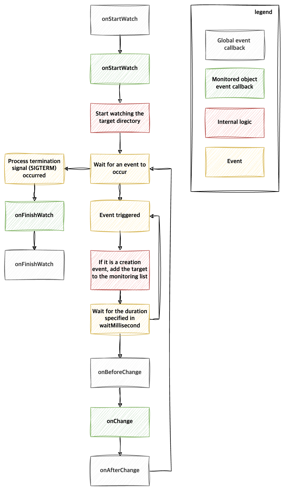

<p align="center">
    <a href="README.md"><b>English</b></a> •
    <a href="README.ko.md"><b>Korean</b></a>
</p>

# Directory Watcher

This program executes predefined commands when changes (creation, modification, deletion) occur within a directory.
Using this tool, you can react to file system changes in real-time and automate specific tasks based on these changes.
For example, you can set up tasks such as automatically creating backups when a file changes in a specific directory or running tests when code changes.

## Features

- Monitor multiple directories
- Configure individual commands to execute for changes in each directory
- Configure common commands to be executed at the start and end of monitoring
- Exclude specific directories within the monitored directory
- Exclude files with specific suffixes within the monitored directory
- Configure a delay between an event and the execution of its associated hook
- Configure whether to monitor subdirectories
- Configure which events to monitor (C: Create, U: Update, D: Delete)
- Define variables that can be used within the execution commands

## Installation

### Homebrew

```shell
brew install seungyeop-lee/tap/directory-watcher
```

### `go install`

```shell
go install github.com/seungyeop-lee/directory-watcher/v2@latest
```

### Docker

```shell
docker pull ghcr.io/seungyeop-lee/directory-watcher
```

### Releases

Download the executable from the [releases page](https://github.com/seungyeop-lee/directory-watcher/releases/latest).

## Usage

You can run `directory-watcher` with the following command:

```shell
directory-watcher
```

It can also be run using docker.

```shell
docker run --rm ghcr.io/seungyeop-lee/directory-watcher

# Known Issue: Inconsistent Delete Events with Bind Mounts
# When deleting files on the host system within a directory that's been bind-mounted into a container, the delete event may not always be detected. 
# This is a known issue with the underlying file system notification library (fsnotify).
# For more details, see: https://github.com/fsnotify/fsnotify/issues/592
```

This command provides the following options:

```shell
Usage:
  directory-watcher [flags]

Flags:
  -c, --config-path string   set config path (default "config.yml")
  -h, --help                 help for directory-watcher
  -l, --log-level string     set log level (default "ERROR")
  -v, --version              version for directory-watcher
```

## config.yml

Refer to the `config.example.yml` file for a practical example.
The `config.yml` file defines the directories to monitor and the commands to execute for changes occurring in each directory.
You can also define commands to be executed when starting or stopping the monitoring process.

```yaml
global:
  lifeCycle:
    onStartWatch: # global onStartWatch hook
      - 'command to execute'
      - dir: 'directory path where the command will be executed'
        cmd: 'command to execute'
      - dir: 'directory path where the command will be executed'
        cmd:
          - 'command to execute 1'
          - 'command to execute 2'
    onBeforeChange: # global onBeforeChange hook
      [ Same specification as global onStartWatch hook ]
    onAfterChange: # global onAfterChange hook
      [ Same specification as global onStartWatch hook ]
    onFinishWatch: # global onFinishWatch hook
      [ Same specification as global onStartWatch hook ]
watchTargets:
  - path: [ path of the directory to monitor ]
    lifeCycle:
      onStartWatch: # onStartWatch hook
        [ Same specification as global onStartWatch hook ]
      onChange: # onChange hook
        [ Same specification as global onStartWatch hook ]
      onFinishWatch: # onFinishWatch hook
        [ Same specification as global onStartWatch hook ]
    option:
      excludeDir:
        - [ path of the directory to exclude from monitoring ]
      excludeSuffix:
        - [ file suffix to exclude from monitoring ]
      waitMillisecond: [ wait time after an event occurs before executing the hook, default is 100 ]
      watchSubDir: [ whether to monitor subdirectories, default is true ]
      watchEvent: [ monitoring events (C: create, U: update, D: delete), default is "CUD" ]
      noWait: [ whether to execute the hook immediately without waiting after an event occurs, default is false ]
```

### Command Execution Location

The following describes the command execution location for each hook:

| dir | global onStartWatch, global onFinishWatch | Other hooks             |
|-----|-------------------------------------------|-------------------------|
| O   | Specified dir location                    | Specified dir location  |
| X   | Program execution location                | Specified path location |

### Available Variables in Execution Commands

| Variable        | Description                                             | Example (when `test/dir2` is set as the monitored directory) |
|-----------------|---------------------------------------------------------|--------------------------------------------------------------|
| {{.Path}}       | Relative path of the file where the event occurred      | test/dir2/b.txt                                              |
| {{.AbsPath}}    | Absolute path of the file where the event occurred      | /Users/example/directory-watcher/test/dir2/b.txt             |
| {{.FileName}}   | File name where the event occurred                      | b.txt                                                        |
| {{.ExtName}}    | Extension of the file where the event occurred          | .txt                                                         |
| {{.DirPath}}    | Relative path of the directory where the event occurred | test/dir2                                                    |
| {{.DirAbsPath}} | Absolute path of the directory where the event occurred | /Users/example/directory-watcher/test/dir2                   |
| {{.Event}}      | Event type (C: create, U: update, D: delete)            | C                                                            |

### waitMillisecond and noWait

- When an event occurs within `watchTargets.path`, the hook is executed after waiting for waitMillisecond.
- If another event occurs within `watchTargets.path` during the waiting period, the previous event is ignored. That is, the waitMillisecond is reset based on the new event, and the hook is executed after the new waiting period.
- If you want the hook to be executed immediately for every event within `watchTargets.path` without ignoring any events, set noWait to true. (Hooks for events are executed sequentially.)

## Operational Diagram

The following diagram illustrates how `Directory Watcher` works:



## License

This project is licensed under the [GPL-3.0 License](LICENSE). See the license file for details.
